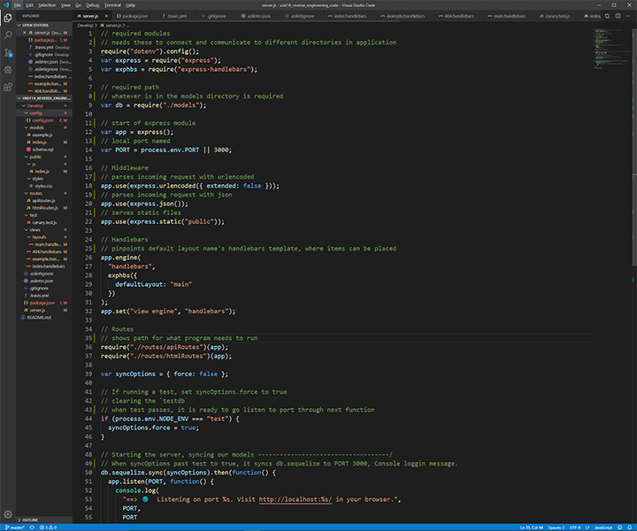

# Reverse Engineering Code

In Reverse Engineering code, I go through each file line by line and explain what it does. After the walk-through of the code, I add instructions on how to add changes to this project in the google doc. 

## How it was done. 

I opened each file, to the best of my knowledge, tried to explain what was going on with the code. If I didn't know, I would do a search on google to understand what was going on, then add my explanation.

### Prerequisites

From repository, (https://github.com/itsmedexter/Reverse_Engineering_code), you can download the Develop folder and open each  file to see explanations of what the code is doing. Also read my google doc, (https://docs.google.com/document/d/1mFbsygaePZ8ggA9p8zo_XlWKjYoC-soyhhLiEHYEqxA/edit?usp=sharing), on what I think the code is doing and how to add to it. 

## Deployed Link

* No direct link, please see "Prerequisites" on how to view.

## Author
Dexter Valencia 

- [Link to Reverse Engineering the code repository](https://github.com/itsmedexter/Reverse_Engineering_code)
- [Link to Github](https://github.com/itsmedexter)
- [Link to LinkedIn](https://www.linkedin.com/in/dextervalencia/)

## License

This project is licensed under the MIT License 

## Acknowledgments

* Thanks to everyone who helped me understand the code!  

